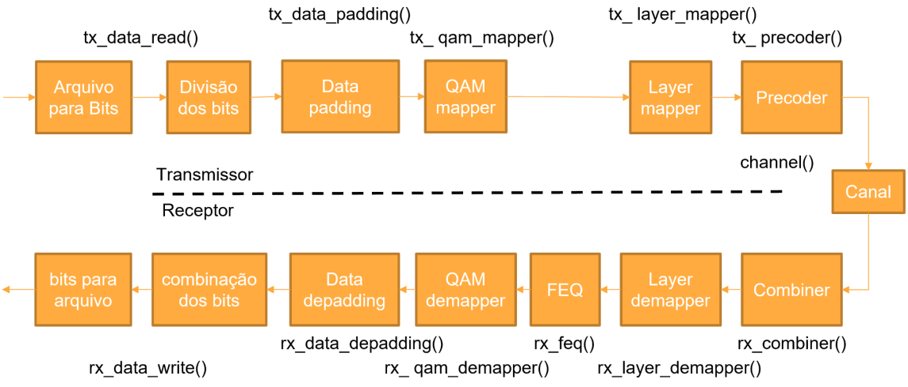

# Projeto de Engenharia II - Implementação de Sistema de Comunicação Digital MIMO

Projeto feito para a disciplina de Projeto de Engenharia II ministrada no segundo semestre na Faculdade de Computação e Telecomunicações da Universidade Federal do Pará. O objetivo deste projeto é desenvolver uma biblioteca em C contendo funções que implementam operações matriciais. A biblioteca resultante será utilizada para implementar um sistema de Comunicação Digital MIMO (Multiple-in, Multiple-out) em Linguagem C. O sistema a ser implementado é o descrito na imagem abaixo:



### 🚀 Etapas de desenvolvimento

Ao longo da disciplina foram propostas as seguintes tarefas:

- [x] Tarefa 1 - Criação e configuração de conta e envio de contribuições no código (Tutorial Github).
- [x] Tarefa 2 - Implementação de funções para álgebra matricial e operações com matrizes.	
- [x] Tarefa 3 - Documentação do código com comentários e doxygen e automação com makefile.
- [x] Tarefa 4 - Integração de cálculo de SVD na biblioteca matrizes a partir de biblioteca externa.
- [x] Tarefa 5 - Implementação de Sistema de Comunicação Digital MIMO

### 💻 Pré-requisitos
Certifique-se de ter os seguintes requisitos instalados no seu sistema antes de utilizar o Makefile:

* gcc (GNU Compiler Collection)
* doxygen (opcional)

## Comandos disponíveis
O Makefile oferece vários comandos para executar tarefas específicas. Abaixo estão os comandos disponíveis e suas descrições:

### Comandos de compilação
- make: O comando padrão. Compila o código fonte e gera o executável aplicacao.
- make clean: Remove todos os arquivos gerados durante a compilação, incluindo o diretório de objetos, executáveis de teste e arquivos de documentação.

### Comandos de execução
* make teste: Executa o arquivo aplicacao gerado. Isso executará o código do arquivo pds_telecom.c.
  ```sh
  make teste
  ```

* make doc: Gera a documentação do código fonte usando o doxygen. Os arquivos de documentação são armazenados no diretório doc/html.
 ```sh
  make doc
  ```
* make doxy: Abre a documentação gerada em um navegador padrão. Este comando é específico para sistemas Windows.
 ```sh
  make doxy
  ```
  
### Dependências externas
O Makefile usa as seguintes dependências externas:

- lgslcblas: Biblioteca GSL para operações matemáticas.
- lgsl: Biblioteca GSL para funções especiais.
- lm: Biblioteca de matemática padrão.

### Estrutura do diretório
O Makefile assume a seguinte estrutura de diretórios:

- src: Diretório principal que contém os arquivos de origem do código fonte.
- matrizes: Subdiretório dentro de src que contém os arquivos relacionados às operações matriciais.
- MIMO: Subdiretório dentro de src que contém os arquivos relacionados ao código pds_telecom.c que implementa o sistema de comunicação MIMO
- build: Diretório onde os arquivos de objeto e executáveis serão gerados.
- doc: Diretório que armazena os arquivos de documentação.
- html: Subdiretório dentro de doc que armazena a documentação HTML gerada pelo doxygen.

