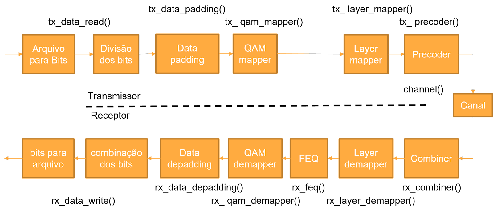

# Projeto de Engenharia II

Projeto feito para a disciplina de Projeto de Engenharia II ministrada no segundo semestre na Faculdade de Computação e Telecomunicações da Universidade Federal do Pará. O objetivo deste projeto é desenvolver uma biblioteca em C contendo funções que implementam operações matriciais. Essas funções serão testadas e validadas, levando em consideração as dimensões dos operandos. O arquivo "matrizes.c" conterá a implementação dessas funções, enquanto outro arquivo C terá uma função "main" para realizar testes em cada uma delas. A biblioteca resultante será utilizada para implementar um sistema de Comunicação Digital MIMO (Multiple-in, Multiple-out) em Linguagem C. O sistema a ser implementado é o descrito na imagem abaixo:

### Etapas de desenvolvimento

Ao longo da disciplina foram propostas as seguintes tarefas:

- [x] Tarefa 1
- [x] Tarefa 2
- [x] Tarefa 3
- [ ] Tarefa 4
- [ ] Tarefa 5

